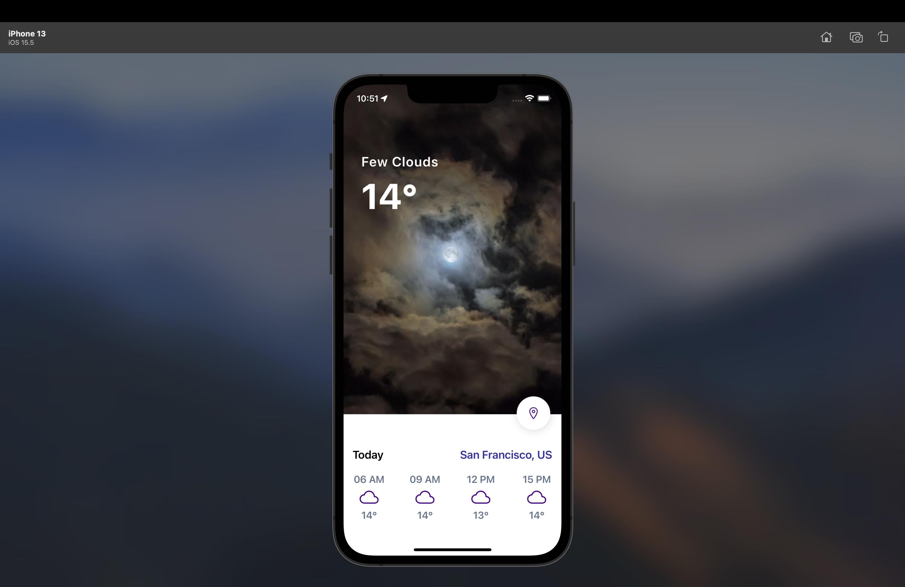

# Weather App

An app that use your current location to determine the temperature of your area.

## Installation

```bash
npm install -g expo-cli
```
clone https://github.com/kou25/WeatherAppReactNative . 

```bash
npm install or yarn
```

```bash
expo start
```



## Contributing
Pull requests are welcome. For major changes, please open an issue first to discuss what you would like to change.

Please make sure to update tests as appropriate.

## License
[MIT](https://choosealicense.com/licenses/mit/)
